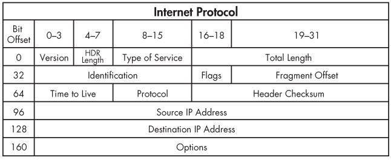

## Welcome to class 3!

### Black Hat Python3 

### Raleigh ISSA

---

## Github repo

https://github.com/tiarno/bhp3_class

---

## Summary from last class

- mapping an app
- word lists for enumeration
- word lists for password bruteforce
- browser tools
- `lxml` for web parsing

---

## Poll

https://linkto.run/p/OTWCR171

---

## Wrapping up BHP Chapter 5

Web Hacking

---

## A note on iterating a queue

You can't do it that way :-)

---

## Clean up `mapper.py`

- contextlib/ context manager
- thread.join()

https://pymotw.com/3/contextlib/index.html#from-generator-to-context-manager

---

## A note on `lxml`

General notes and demo

---

```python
from lxml import etree
url = 'http://www.textfiles.com/hacking/INTERNET'
parser = etree.HTMLParser()
tree = etree.parse(url, parser=parser)
headelem = tree.find('//h1')
print(headelem.text)
```

---

## Exception Handling

https://www.pythonforthelab.com/blog/learning-not-to-handle-exceptions/

---

## Black Hat Python, Chapter 3

---

## Sockets

https://github.com/crazyguitar/pysheeet/blob/master/docs/notes/python-socket.rst


---

## Socket server

Required:
- **create**
- **bind**

Maybe, depends on type:

- listen
- accept

---

```python 
sock_obj = socket.socket(socket_family,  # AF_INET
                         socket_type,    # SOCK_STREAM, SOCK_DGRAM, SOCK_RAW
                         socket_protocol # IPPROTO_ICMP, IPPROTO_TCP,
                        )
```

---

##  Socket client

- **connect**

---

# Socket communication

- send
- recv
- sendto
- recvfrom

---

## Let's Code!

`sniffone.py`


---

## IP Packet


---

## IP Header



---

## Code 

- c_ip.py
- struct_ip.code

- c_icmp.py
- struct_icmp.py

---

## `struct` package

https://docs.python.org/3/library/struct.html

---

## Header Parts

    1.     B (ver, hdrlen)
    2.     B tos
    3.     H total len
    4.     H identification
    5.     H flags + frag offset
    6.     B ttl
    7.     B protocol
    8.     H checksum
    9.     4s src ip
    10.    4s dst ip

---

## High nybble

We have one byte and want the high-order nybble:

| 0 | 1 | 0 | 1 | 0 | 1 | 1 | 0 |  >> 4 |
|---|---|---|---|---|---|---|---|-------|
| 0 | 0 | 0 | 0 | 0 | 1 | 0 | 1 |       |

---

## Low nybble

We have one byte and want the low-order nybble:

| 0 | 1 | 0 | 1 | 0 | 1 | 1 | 0 |  &F   |
|---|---|---|---|---|---|---|---|-------|
| 0 | 0 | 0 | 0 | 1 | 1 | 1 | 1 |       |
| 0 | 0 | 0 | 0 | 0 | 1 | 1 | 0 |       |

---

## Python code

```python
    >>> m = 66
    >>> m
    66
    >>> bin(m)
    '0b1000010' # or 0100 0010
    >>> bin(m>>4)
    '0b100'     # or 0100
    >>> bin(m&0xF)
    '0b10'      # or      0010
```

---

```python
    "{0:016b}".format(0x1234)
    f"{0x1234:016b}"


    >>> '{0:08b}'.format(0x45)
    '01000101'
    >>> '{0:04b}'.format(0x45>>4)
    '0100'
    >>> '{0:04b}'.format(0x45&0xF)
    '0101'
```

---

## Test it out:

- `ipheader0.py`

---

## ICMP Header


---

## icmp headers

- ping
- traceroute

https://www.erg.abdn.ac.uk/users/gorry/course/inet-pages/icmp-code.html

---

## Test it out:

- `ipheader1.py`

---

## ipaddress package

https://docs.python.org/3/library/ipaddress.html

---

## UDP Scanner

- how it works
- UDP packet to unused port
    - network unreachable (from router)
    - host unreachable (from router)
    - port unreachable **!**

---

## Test it out

- `scanner.py`

---

## Reading 1


https://docs.python.org/3/library/struct.html#format-characters

https://docs.python.org/3.5/library/ctypes.html#ctypes.Structure

http://www.firewall.cx/networking-topics/protocols/icmp-protocol/153-icmp-destination-unreachable.html

---

## Your Job

- Pick your favorite method to define headers
- Add an IP and ICMP class to your `bhp3_class/packets/__init__.py` file
- Create your own network UDP scanner in your `bhp3_class/packets` module

---

## Feedback please!

- tim@reachtim.com
- discord: https://discord.gg/WR23qUj
